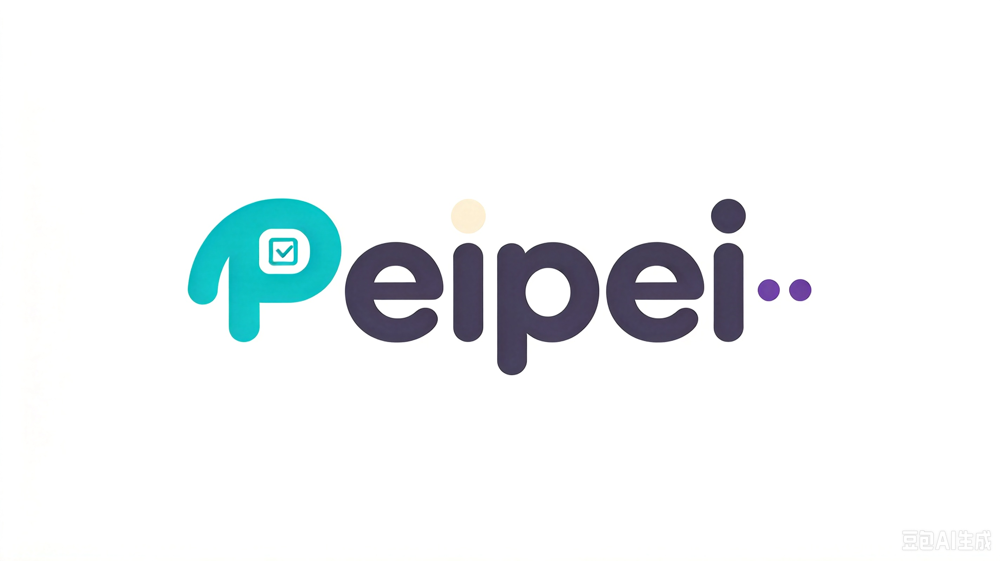
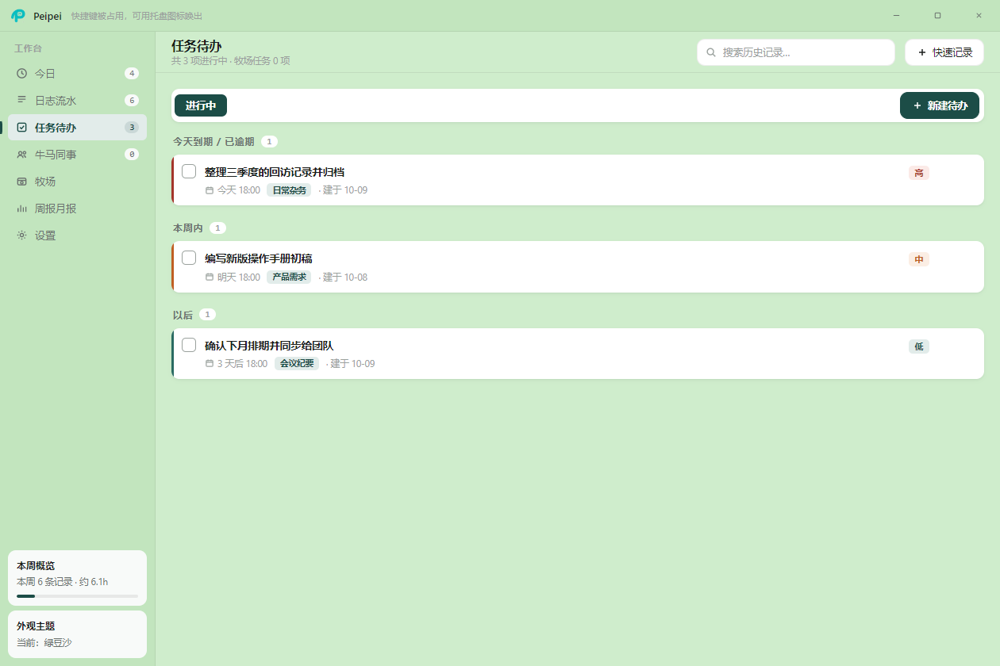
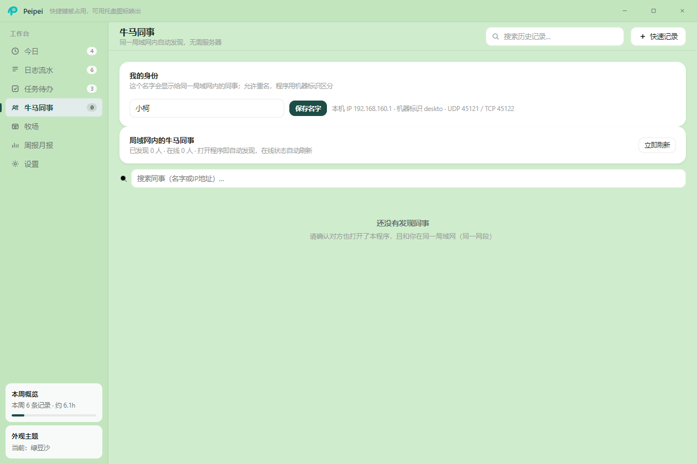
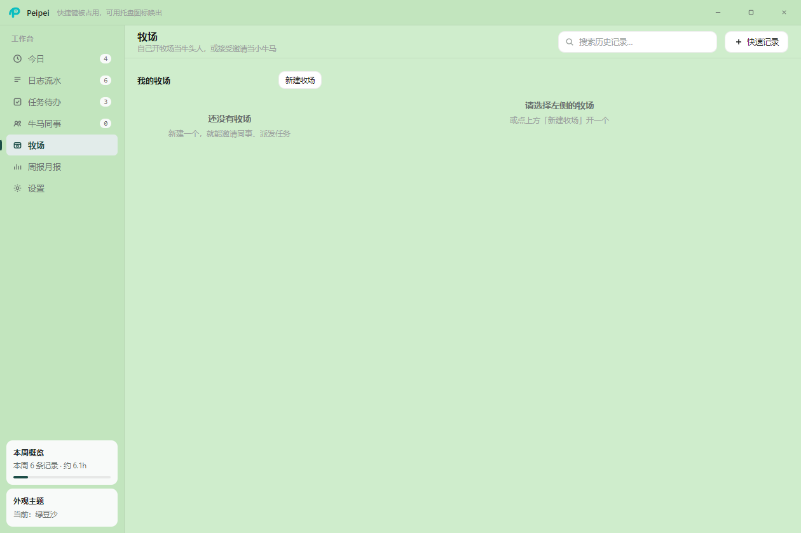

# PeiPei · 工作记录

**一个免安装、双击即用的 Windows 工作记录小工具**

记流水、清待办、出周报月报，还能和同一个局域网里的同事互相看见状态、互相派活。

> 不用装环境、不用配数据库、不用注册账号、不用联网。下载 → 双击 → 开始记。

---

## 界面预览

| 启动页 | 工作台 |
| :---: | :---: |
|  |  |
| **牛马同事** —— 同局域网自动发现同事 | **牧场** —— 工作组与任务流转 |
|  |  |

---

## 三个核心特点

### 一、数据只在你自己电脑上

- 所有记录都保存在本机，**不经过任何服务器，也不会上传云端**；
- 不注册、不登录，断网也能照常用；
- 程序自带备份 / 恢复功能，换电脑时把数据文件拷过去即可。

### 二、局域网内协作，不依赖任何服务器

- 同一个 Wi-Fi / 局域网里的同事，打开程序就能**自动发现彼此**，不用手动加好友、不用填 IP；
- 能看到谁在线，可以直接给对方派发任务、流转待办；
- 对方当时不在线也没关系，消息会暂存下来，**等对方一上线自动补发**；
- 整个协作过程**只在你们自己的局域网内进行**，不走互联网，也不需要谁去搭服务器。

### 三、为「每天记一笔」而设计

- **日志流水**：想到什么就「记一笔」，回车即存，支持补录以前漏记的内容；
- **任务待办**：新建待办、标记进行中 / 已完成，工作清单一目了然；
- **周报月报**：一键导出成 Excel 表格，写周报不用再靠回忆；
- 全局快捷键随时唤出、可收进系统托盘、支持浅色 / 深色主题。

---

## 界面与模块

| 模块 | 能干什么 |
| --- | --- |
| **工作台** | 打开就是「今日」+「本周」概览，一眼知道今天干了啥、这周进度如何 |
| **日志流水** | 「记一笔」直接写，回车即存；支持插图片、支持补录 |
| **任务待办** | 新建、进行中、已完成，清单式管理 |
| **局域网同事**（界面里叫「牛马同事 / 牧场」） | 同局域网自动发现同事、显示在线状态、可搜索、可派发任务 |
| **周报月报** | 一键导出 Excel |
| **设置** | 浅色 / 深色主题、开机自启、全局快捷键、数据备份与恢复 |

---

## 下载

到本仓库右侧的 **[Releases](https://github.com/KentWangDongKai/PeiPei/releases)** 页面下载：

| 你的系统 | 下载哪个文件 | 大小 |
| --- | --- | --- |
| Windows 10 / 11 | `Peipei_win10.exe` | 约 100 MB |
| Windows 7（含 SP1） | `Peipei_win7.exe` | 约 62 MB |

> 两个都是**免安装**的：下载下来就是一个 exe，双击直接运行，不用解压、不用装 Node.js、不需要管理员权限。

## 使用方法

1. 到 Releases 页面下载对应你系统的那个 `.exe`；
2. **双击运行**；
3. 第一次打开会让你起个名字，这个名字会显示给同一局域网内的同事；
4. 开始记工作流水吧。

> **首次运行提示**：Windows 可能弹出蓝色的「已保护你的电脑」提示。这是因为个人开发者的小工具没有花钱购买数字签名证书，属于正常现象 ——
> 点 **「更多信息」→「仍要运行」** 即可。

### 想和同事协作？

1. 确保大家的电脑连在**同一个局域网**（同一个 Wi-Fi 或同一个公司网络）；
2. 每个人打开程序后，在「牛马同事」里就能看到彼此；
3. 选中同事即可派发任务，对方不需要任何额外设置。

---

## 常见问题

**Q：会把我记的内容传到网上吗？**
不会。所有记录只存在你自己电脑本地。局域网功能仅用于在同一个网络里发现同事，不经过互联网。

**Q：一定要联网才能用吗？**
不需要。单机使用完全离线；只有局域网协作时需要在同一个网络里。

**Q：换电脑了数据怎么办？**
程序「设置」里自带备份 / 恢复，把备份文件拷到新电脑恢复即可。

**Q：杀毒软件报毒？**
个人开发者没有购买代码签名证书，部分杀毒软件会对未签名的 exe 误报。本程序不读写系统关键位置、不收集上传任何数据，请放心使用。

**Q：怎么卸载？**
免安装版就是一个 exe 文件，删掉它即可；再删掉它的数据目录就彻底干净了。

---

## 反馈与建议

欢迎提建议、报 Bug、许愿新功能：

- 点上方 **[Issues](https://github.com/KentWangDongKai/PeiPei/issues)** 标签 → **New Issue**，把你的想法写下来；
- 提之前可以先搜一下有没有人已经提过，避免重复。

如果这个小工具帮到了你，给个 **Star** 就是最大的鼓励。

---

## 许可

免费使用，详见 [LICENSE](LICENSE)。
*（内容由AI生成，仅供参考）*
